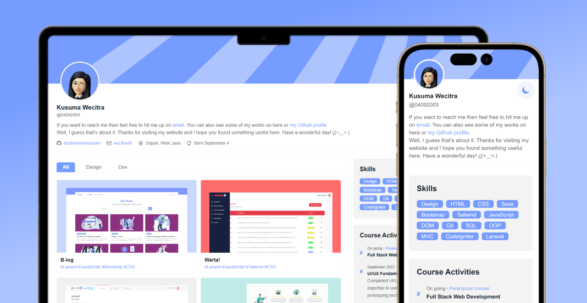

# 🐦 TwitFolio

**TwitFolio** is a personal passion project I designed back in 2023, and it remains one of my absolute favorite creations. The main idea was simple yet challenging, take the familiar, fast-paced layout of a Twitter/X feed and transform it into a clean, interactive professional showcase.

Back then, I felt most developer portfolios were a bit too rigid and identical. To challenge that, I built **TwitFolio**, a minimalist, engaging ecosystem that feels like a lightweight desktop app. It neatly packs my entire early front-end learning journey, showcasing my projects, skills, certificates, and activity updates from when I first started coding.

*Feel free to fork and use this template for your own portfolio! As you look through the repository, you'll see that the setup is quite simple. Since I built this during the early days of my front-end journey, the function names, variables, and data keys are heavily written in my everyday casual language.* 

## 💬 Let's Connect!

If you like this design or want to chat about front-end slicing, tech stacks, or anything in between, feel free to check out the live demo or say hi!

* **Live Demo:** [Visit TwitFolio](https://doobeedoobeedam.github.io/twitfolio/)
* **Main Portfolio:** [Kusuma Wecitra](https://wecitra.github.io)